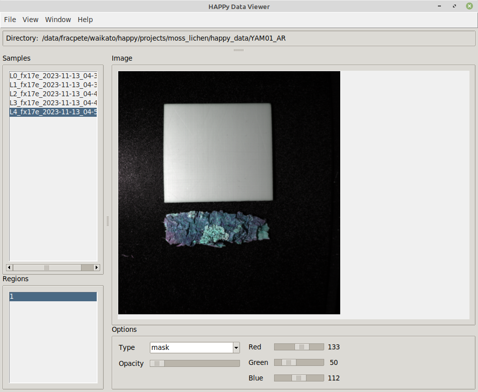

Used for viewing data that has been converted into a HAPPy folder structure.

* HAPPy directories can be opened via *File -> Open dir...*
* The currently displayed image can be exported via *File -> Export image...*
* The menu items from the *Help* menu open browser windows with relevant pages.



When available, a *mask* can be overlaid with the appropriate *opacity*:


# Command-line

```
usage: happy-data-viewer [-h] [--base_folder BASE_FOLDER] [--sample SAMPLE]
                         [--region REGION] [-r INT] [-g INT] [-b INT] [-o INT]
                         [--listbox_selectbackground LISTBOX_SELECTBACKGROUND]
                         [--listbox_selectforeground LISTBOX_SELECTFOREGROUND]
                         [-V {DEBUG,INFO,WARNING,ERROR,CRITICAL}]

Viewer for HAPPy data folder structures.

optional arguments:
  -h, --help            show this help message and exit
  --base_folder BASE_FOLDER
                        Base folder to display (default: None)
  --sample SAMPLE       The sample to load (default: None)
  --region REGION       The region to load (default: None)
  -r INT, --scale_r INT
                        the wave length to use for the red channel (default:
                        None)
  -g INT, --scale_g INT
                        the wave length to use for the green channel (default:
                        None)
  -b INT, --scale_b INT
                        the wave length to use for the blue channel (default:
                        None)
  -o INT, --opacity INT
                        the opacity to use (0-100) (default: None)
  --listbox_selectbackground LISTBOX_SELECTBACKGROUND
                        The background color to use for selected items in
                        listboxes (default: #4a6984)
  --listbox_selectforeground LISTBOX_SELECTFOREGROUND
                        The foreground color to use for selected items in
                        listboxes (default: #ffffff)
  -V {DEBUG,INFO,WARNING,ERROR,CRITICAL}, --logging_level {DEBUG,INFO,WARNING,ERROR,CRITICAL}
                        The logging level to use. (default: WARN)
```
